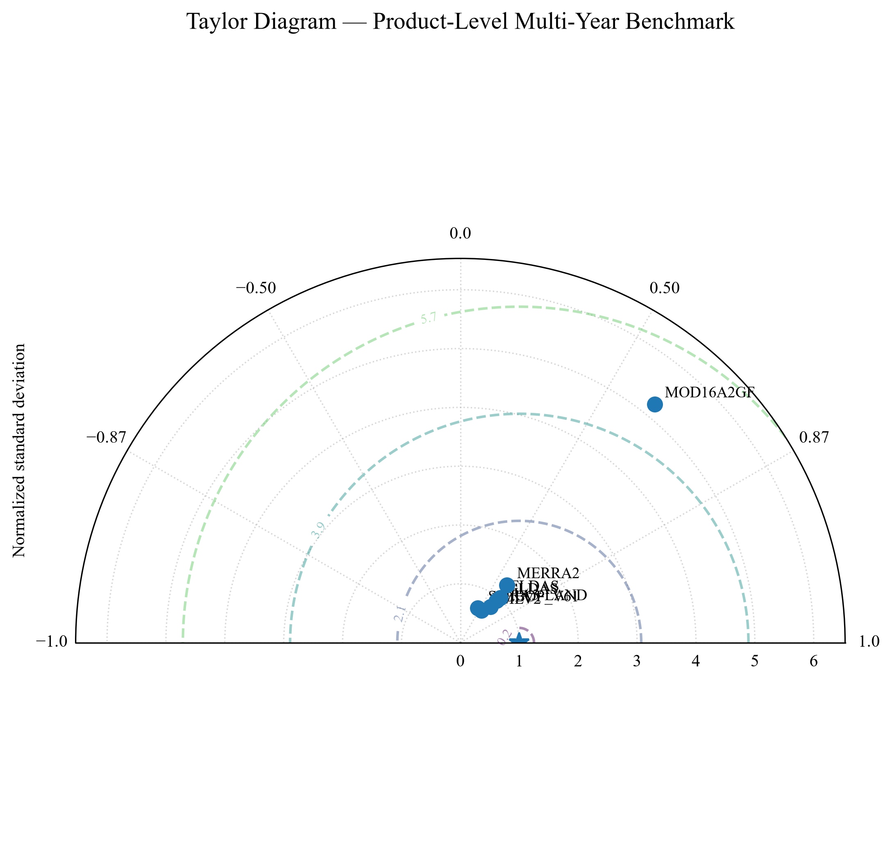
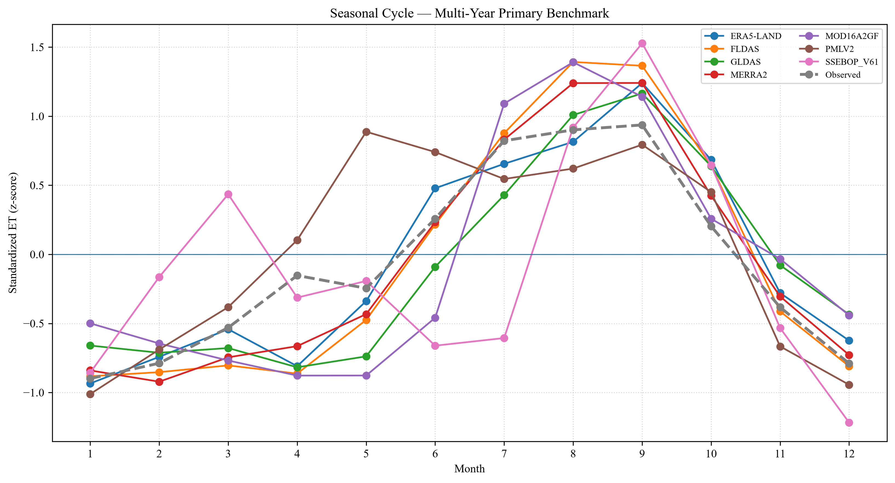

# 🌍 OpenETBench

> **A modular and reproducible framework for benchmarking
> Evapotranspiration (ET) products against Flux Tower observations.**

OpenETBench is an open-source Python framework for evaluating satellite,
reanalysis, land-surface-model, and data-driven Evapotranspiration (ET)
products against in-situ Flux Tower observations.

The framework provides a common pipeline for:

-   preprocessing Flux Tower observations,
-   extracting or ingesting ET products,
-   temporal and spatial harmonization,
-   standardized statistical benchmarking,
-   quality control,
-   multi-site and multi-year comparison,
-   advanced evaluation,
-   and research-ready visualizations and benchmark artifacts.

The current validated benchmark uses **BharatFlux** observations and
covers **2014--2018**, with product/site/year availability determined by
the underlying observations and product coverage.

------------------------------------------------------------------------

## Table of Contents

-   [Why OpenETBench?](#why-openetbench)
-   [What is being benchmarked?](#what-is-being-benchmarked)
-   [Final Benchmark Scope](#final-benchmark-scope)
-   [Key Features](#key-features)
-   [Architecture](#architecture)
-   [Benchmarking Workflow](#benchmarking-workflow)
-   [Supported ET Products](#supported-et-products)
-   [Reference Observations](#reference-observations)
-   [Temporal Harmonization](#temporal-harmonization)
-   [Quality Control and Benchmark
    Layers](#quality-control-and-benchmark-layers)
-   [Benchmark Metrics](#benchmark-metrics)
-   [Final Sprint 7 Results](#final-sprint-7-results)
-   [Advanced Evaluation and
    Visualizations](#advanced-evaluation-and-visualizations)
-   [How to Interpret the Final
    Figures](#how-to-interpret-the-final-figures)
-   [Output Structure](#output-structure)
-   [Project Structure](#project-structure)
-   [Reproducibility](#reproducibility)
-   [Installation](#installation)
-   [Running the Pipeline](#running-the-pipeline)
-   [Extensibility](#extensibility)
-   [Research Interpretation and
    Limitations](#research-interpretation-and-limitations)
-   [Author](#author)

------------------------------------------------------------------------

# Why OpenETBench?

Evapotranspiration is a fundamental component of the terrestrial water
and energy cycles and is widely used in hydrology, agriculture, climate
studies, drought monitoring, and land-surface modelling.

ET products differ in:

-   spatial resolution,
-   temporal resolution,
-   input data,
-   physical assumptions,
-   modelling methodology,
-   spatial and temporal coverage,
-   units and aggregation conventions.

Consequently, comparing ET products requires more than placing two time
series side by side.

OpenETBench provides a **common benchmarking layer** so that products
from different methodological families can be evaluated against the same
Flux Tower reference observations using consistent temporal alignment,
metrics, quality-control rules, and visualization procedures.

------------------------------------------------------------------------

# What is being benchmarked?

At its core, OpenETBench compares a Flux Tower reference ET series with
independently produced ET estimates.

``` text
                         BharatFlux
                         Reference ET
                              │
                              ▼
                     ┌─────────────────┐
                     │   OpenETBench   │
                     └────────┬────────┘
                              │
             ┌────────────────┼────────────────┐
             │                │                │
             ▼                ▼                ▼
        Satellite        Reanalysis      Data-driven /
            ET                ET          LSM-based ET
```

The current benchmark uses **BharatFlux** as the reference and evaluates
multiple ET products through a common downstream pipeline.

The architecture is intentionally not tied to one product or one Flux
Tower network.

------------------------------------------------------------------------

# Final Benchmark Scope

## Reference network

The final benchmark uses **12 BharatFlux sites**:

``` text
BFT   BIT   BKC   DIT   JIT   KKM
KNP   NIT   PVM   SFT   SIT   UIT
```

The available observation years are site-dependent and span
**2014--2018**.

Examples of the available observation periods include:

  Site   Available years
  ------ -----------------
  BFT    2016--2018
  BIT    2016--2017
  BKC    2014--2016
  DIT    2016--2017
  JIT    2016--2018
  KKM    2014--2016
  KNP    2016--2018
  NIT    2016--2018
  PVM    2017
  SFT    2014--2016
  SIT    2016--2018
  UIT    2016--2017

The benchmark therefore **does not assume a rectangular site × year
matrix**. Missing site-years are retained as genuine coverage
limitations rather than artificially filled.

## Final product set

The completed benchmark contains:

``` text
ERA5-LAND
FLDAS
GLDAS
MERRA2
MOD16A2GF
PMLV2
SSEBOP_V61
```

The first six products are handled through the GEE-based workflow used
by OpenETBench. **SSEBop V6.1** was integrated through the
external-product ingestion pathway.

------------------------------------------------------------------------

# Key Features

## 🛰️ Multi-Product ET Evaluation

A common product abstraction allows different ET products to pass
through the same downstream harmonization and benchmarking framework.

## 🌱 Flux Tower Reference Data

The preprocessing layer converts raw BharatFlux observations into
standardized benchmark-ready data, including:

-   loading and discovery,
-   metadata preservation,
-   column standardization,
-   missing-value handling,
-   numeric conversion,
-   LE/ET conversion and preparation,
-   validation,
-   and processed-data persistence.

## ☁️ GEE Integration

The GEE extraction layer provides a common interface for GEE-hosted ET
products, including:

-   Earth Engine initialization,
-   product registration,
-   ImageCollection access,
-   spatial reduction around tower sites,
-   product-specific scale factors,
-   temporal aggregation,
-   date filtering,
-   and standardized tabular export.

## 📦 External Product Integration

SSEBop V6.1 demonstrates that an ET product distributed outside the GEE
workflow can still be converted into the same benchmark representation.

The downstream benchmark therefore operates on a standardized
representation rather than depending on how the original product was
distributed.

## ⏱️ Temporal Harmonization

OpenETBench handles products with different native temporal resolutions:

``` text
8-day product    ───────────────► benchmark-ready series
Daily product    ───────────────► benchmark-ready series
Monthly product  ───────────────► benchmark-ready series
Hourly product   ─► aggregation ─► benchmark-ready series
```

MERRA2, for example, requires aggregation of higher-frequency source
data before comparison.

## 📊 Standardized Metrics

The benchmark calculates:

-   RMSE
-   MAE
-   Bias / absolute bias
-   Pearson correlation
-   R²

## 🔍 Quality Control

Benchmark records are not treated equally when temporal overlap is weak.

The multi-year layer classifies records using the available sample size
and assigns statuses such as:

``` text
STRONG
ADEQUATE
LIMITED
INSUFFICIENT

PRIMARY
REFERENCE_ONLY
```

The primary final benchmark uses the configured threshold:

``` text
N ≥ 10
```

## 📈 Advanced Evaluation

The completed Sprint 8 layer adds:

-   Taylor diagram,
-   seasonal-cycle comparison,
-   interannual variability,
-   site-wise spatial performance.

------------------------------------------------------------------------

# Architecture

``` text
┌─────────────────────────────┐
│        Preprocessing        │
│   BharatFlux observations   │
└──────────────┬──────────────┘
               │
               ▼
┌─────────────────────────────┐
│     Extraction / Ingestion  │
│  GEE + external ET products │
└──────────────┬──────────────┘
               │
               ▼
┌─────────────────────────────┐
│         Harmonization        │
│ Temporal / spatial alignment │
└──────────────┬──────────────┘
               │
               ▼
┌─────────────────────────────┐
│        Benchmarking          │
│ Metrics + QC + comparison   │
└──────────────┬──────────────┘
               │
               ▼
┌─────────────────────────────┐
│       Advanced Evaluation   │
│ Taylor / seasonal / annual  │
│ spatial performance         │
└──────────────┬──────────────┘
               │
               ▼
┌─────────────────────────────┐
│           Export            │
│ CSV / JSON / PNG / README   │
└─────────────────────────────┘
```

This separation keeps product-specific extraction logic independent from
the common evaluation logic.

------------------------------------------------------------------------

# Benchmarking Workflow

The completed project is organized into the following conceptual stages:

``` text
Raw BharatFlux Data
        │
        ▼
Observation Preprocessing
        │
        ▼
Processed BharatFlux Dataset
        │
        ├─────────────────────────────┐
        │                             │
        ▼                             ▼
Reference ET                    ET Product Registry
                                      │
                           ┌──────────┴──────────┐
                           │                     │
                           ▼                     ▼
                       GEE Products       External Products
                           │                     │
                           └──────────┬──────────┘
                                      ▼
                              Temporal Harmonization
                                      │
                                      ▼
                              Site × Product × Year
                                      │
                                      ▼
                                Quality Control
                                      │
                                      ▼
                         Multi-Year Site × Product
                                      │
                                      ▼
                          Product-Level Comparison
                                      │
                                      ▼
                            Advanced Evaluation
                                      │
                                      ▼
                            Research-Ready Outputs
```

------------------------------------------------------------------------

# Supported ET Products

  Product          Family / role                       Native temporal scale used Integration
  ---------------- --------------------------------- ---------------------------- --------------------
  **ERA5-LAND**    Reanalysis / land surface                                Daily GEE
  **FLDAS**        Land-surface / reanalysis                              Monthly GEE
  **GLDAS**        Land-surface model / reanalysis                          Daily GEE
  **MERRA2**       Reanalysis                                      Hourly → Daily GEE
  **MOD16A2GF**    Satellite ET                                             8-day GEE
  **PMLV2**        Data-driven / satellite-based                            8-day GEE
  **SSEBOP_V61**   Satellite ET                                           Monthly External ingestion

The benchmark intentionally does not require every product to have
identical temporal or spatial coverage.

------------------------------------------------------------------------

# Reference Observations

The current reference dataset is **BharatFlux**.

Benchmark-ready observations contain standardized fields such as:

``` text
Date
DoY
LE
ET
```

For each benchmark comparison, observed and product ET are aligned using
their common temporal support.

This is particularly important because the evaluated products operate at
different native temporal resolutions.

------------------------------------------------------------------------

# Temporal Harmonization

ET products do not share a common temporal resolution. OpenETBench
therefore treats temporal resolution as part of the product definition.

The harmonization layer provides:

-   temporal alignment,
-   common-date filtering,
-   Day-of-Year handling,
-   product-specific aggregation,
-   observation/product merging,
-   and consistent benchmark-ready representations.

The resulting records contain fields such as:

``` text
Date
DoY
Observed_ET
Satellite_ET
```

The final benchmark is therefore based on **matched temporal
observations**, rather than assuming that every product has values for
every observation timestamp.

------------------------------------------------------------------------

# Quality Control and Benchmark Layers

A key design decision in OpenETBench is the separation between
**year-specific benchmarking** and **multi-year benchmarking**.

## Year-specific layer

Each available:

``` text
Product × Site × Year
```

combination is evaluated independently.

This preserves information about:

-   year-to-year changes,
-   site-specific data availability,
-   temporal overlap,
-   and product-specific coverage.

## Multi-year layer

The available years are then combined at the:

``` text
Product × Site
```

level.

The multi-year layer records:

-   available years,
-   total valid paired observations,
-   RMSE,
-   MAE,
-   absolute bias,
-   correlation,
-   R²,
-   sample-size category,
-   and benchmark status.

This two-layer structure avoids hiding poor or missing temporal support
behind a single aggregate score.

------------------------------------------------------------------------

# Benchmark Metrics

  -----------------------------------------------------------------------
  Metric                              Interpretation
  ----------------------------------- -----------------------------------
  **RMSE**                            Overall magnitude of error, with
                                      larger errors receiving greater
                                      weight

  **MAE**                             Average absolute magnitude of error

  **Bias**                            Direction and magnitude of
                                      systematic over/underestimation

  **Pearson correlation**             Strength of linear temporal
                                      association

  **R²**                              Fraction of variance explained by
                                      the fitted relationship
  -----------------------------------------------------------------------

These metrics should be interpreted together. A product can have good
correlation while still having substantial systematic bias, or low error
while failing to reproduce temporal variability.

------------------------------------------------------------------------

# Final Sprint 7 Results

The completed unified benchmark produced:

``` text
Year-level benchmark records: 193
Raw extraction pairs:         27,255
```

The final product-level multi-year comparison produced the following
overall ordering under the implemented ranking procedure:

  ----------------------------------------------------------------------------------
          Rank Product           Median RMSE   Median MAE        Median    Mean rank
                                                            correlation 
  ------------ ---------------- ------------ ------------ ------------- ------------
             1 **ERA5-LAND**           1.179        0.937         0.644          2.0

             2 **FLDAS**               1.373        1.139         0.664          2.8

             2 **GLDAS**               1.453        1.095         0.655          2.8

             4 **PMLV2**               1.194        0.884         0.552          3.4

             5 **MERRA2**              1.560        1.163         0.627          4.8

             6 **MOD16A2GF**          11.760        9.231         0.631          5.2

             7 **SSEBOP_V61**         27.306       23.081         0.453          7.0
  ----------------------------------------------------------------------------------

### Important interpretation

This table is a **benchmark result for the current BharatFlux
experiment**, not a universal ranking of ET products.

The products have different:

-   site coverage,
-   year coverage,
-   temporal resolution,
-   valid-pair counts,
-   and data availability.

In particular, SSEBop has fewer eligible site combinations than the GEE
products. Therefore, its position should be interpreted together with
the coverage and QC tables rather than as an unconditional statement
that it is globally inferior.

Similarly, the large MOD16A2GF and SSEBop error values indicate weaker
agreement **under the present benchmark configuration**, but should not
by themselves be interpreted as a general statement about product
quality outside this experiment.

------------------------------------------------------------------------

# Advanced Evaluation and Visualizations

Sprint 8 generates four research-facing figures under:

``` text
results/summary/sprint8/figures/
```

The figures are embedded below so that the benchmark can be inspected
directly from the repository README.

------------------------------------------------------------------------

## 1. Taylor Diagram



### What it shows

The Taylor diagram summarizes product-level multi-year performance
using:

-   correlation with BharatFlux,
-   normalized standard deviation,
-   and centered RMSD contours.

The reference point represents the ideal case:

``` text
Correlation = 1
Normalized standard deviation = 1
```

A product closer to this reference point has a combination of:

-   stronger temporal agreement,
-   more similar variability,
-   and lower centered error.

### How to interpret it

-   **Higher correlation** → better temporal association.
-   **σ / σref ≈ 1** → product variability resembles the observations.
-   **Closer to the reference point** → better overall agreement.
-   **Lower centered RMSD** → smaller pattern/variability mismatch after
    removing mean bias.

The diagram uses **site-level statistics summarized by product
medians**, so it should be interpreted as a product-level multi-year
summary rather than a visualization of every individual site.

------------------------------------------------------------------------

## 2. Seasonal Cycle



### What it shows

The seasonal-cycle figure compares the typical month-by-month behavior
of the products against the BharatFlux reference.

The values are standardized as **z-scores** within each Site × Product
series before pooling.

Therefore, the figure emphasizes:

-   timing of seasonal peaks,
-   timing of seasonal minima,
-   amplitude relative to each series' own variability,
-   and overall seasonal shape.

### Why standardization is used

The products have different native temporal resolutions and sampling
characteristics. Directly pooling their raw magnitudes would make the
visualization difficult to interpret.

Standardization allows the figure to answer:

> **Does the product reproduce the seasonal pattern observed by the Flux
> Towers?**

rather than:

> **Which product has the largest raw ET value?**

A curve that follows the observed seasonal shape closely indicates
better reproduction of seasonal timing and variability.

------------------------------------------------------------------------

## 3. Interannual Variability


### What it shows

The interannual figure evaluates how products reproduce **year-to-year
departures from their own mean behavior**.

Annual ET values are converted to standardized anomalies:

``` text
annual anomaly = (annual value − multi-year mean) / multi-year standard deviation
```

This allows products with different absolute magnitudes to be compared
in terms of their ability to capture:

-   relatively high-ET years,
-   relatively low-ET years,
-   and the direction of year-to-year changes.

### How to interpret it

The important question is whether product anomalies move in the same
direction as the observed anomalies.

For example:

``` text
Observed:   low → high → low
Product:    low → high → low
```

indicates that the product captures the interannual pattern well, even
if its absolute ET magnitude differs from the observations.

Products with only one available year cannot provide meaningful
interannual variability and are therefore excluded from this diagnostic.

------------------------------------------------------------------------

## 4. Spatial Performance Pattern


### What it shows

The spatial figure maps the **BharatFlux tower locations** and colors
each site according to its multi-year RMSE for the focal product.

The map uses the India administrative boundary supplied for the project.

### Important clarification

This is a:

> **site-wise performance map**

It is **not** a gridded spatial validation of ET fields.

Each point represents a Flux Tower location, and the color represents
the benchmark error at that site.

Therefore, the figure answers:

> **Where does the evaluated product perform relatively better or worse
> across the BharatFlux sites?**

It does not answer:

> **Where across India does the ET product reproduce the spatial ET
> field correctly?**

That second question would require gridded reference observations or an
independent spatial validation framework, which is outside the current
site-based OpenETBench design.

------------------------------------------------------------------------

# Reading the Four Figures Together

The four Sprint 8 diagnostics answer different questions:

  -----------------------------------------------------------------------
  Diagnostic                          Main question
  ----------------------------------- -----------------------------------
  **Taylor diagram**                  Does the product reproduce
                                      variability and temporal
                                      association?

  **Seasonal cycle**                  Does it reproduce the seasonal
                                      pattern?

  **Interannual variability**         Does it reproduce year-to-year
                                      departures?

  **Spatial performance**             Does performance vary
                                      systematically across tower
                                      locations?
  -----------------------------------------------------------------------

Together they provide a more informative evaluation than a single RMSE
or correlation value.

``` text
                    Overall ET Evaluation
                           │
       ┌───────────────────┼───────────────────┐
       │                   │                   │
       ▼                   ▼                   ▼
   Temporal            Variability          Spatial
   agreement           structure           variation
       │                   │                   │
       ├── Taylor          ├── Seasonal       └── Site RMSE
       └── Correlation     └── Interannual
```

------------------------------------------------------------------------

# Output Structure

The final project produces both site/product benchmark artifacts and
consolidated Sprint 7--8 summaries.

``` text
results/
│
├── <SITE>/
│   └── <PRODUCT>/
│       ├── extraction.csv
│       ├── benchmark.json
│       ├── scatter.png
│       ├── timeseries.png
│       └── map.png
│
└── summary/
    ├── sprint7_ssebop/
    │   ├── inventory.csv
    │   ├── yearly_benchmark.csv
    │   └── multiyear_benchmark.csv
    │
    ├── sprint7_unified/
    │   ├── product_site_year.csv
    │   ├── product_site_multiyear.csv
    │   ├── product_multiyear_summary.csv
    │   ├── multiyear_qc.csv
    │   ├── coverage_matrix.csv
    │   └── unified_benchmark.json
    │
    ├── sprint8/
    │   ├── data/
    │   │   ├── taylor_statistics.csv
    │   │   ├── seasonal_cycle.csv
    │   │   ├── interannual_variability.csv
    │   │   └── spatial_performance.csv
    │   │
    │   ├── figures/
    │   │   ├── taylor_diagram.png
    │   │   ├── seasonal_cycle.png
    │   │   ├── interannual_variability.png
    │   │   └── spatial_performance.png
    │   │
    │   └── sprint8_report.json
    │
    └── final/
        ├── benchmark_tables/
        ├── README_FINAL.md
        └── reproducibility_manifest.json
```

------------------------------------------------------------------------

# Project Structure

``` text
OpenETBench/
│
├── data/
│   ├── raw/
│   ├── intermediate/
│   ├── processed/
│   └── maps/
│       └── india/
│           ├── in.shp
│           ├── in.shx
│           ├── in.dbf
│           └── in.prj
│
├── docs/
├── figures/
├── notebooks/
│   ├── experiments/
│   └── workflows/
│
├── results/
│   └── summary/
│
├── src/
│   ├── preprocessing/
│   ├── extraction/
│   ├── harmonization/
│   ├── benchmarking/
│   ├── visualization/
│   └── scripts/
│
├── tests/
├── CITATION.cff
├── CONTRIBUTING.md
├── environment.yml
├── LICENSE
├── pyproject.toml
├── requirements.txt
└── README.md
```

------------------------------------------------------------------------

# Reproducibility

The completed pipeline keeps the major benchmark stages explicit and
scriptable.

The principal workflow is:

``` text
Sprint 5
  ↓
Quality control / low-N diagnostics

Sprint 6
  ↓
Benchmark interpretation

Sprint 7
  ↓
External SSEBop integration
  ↓
Multi-year GEE extension
  ↓
Unified Product × Site × Year benchmark
  ↓
Multi-year QC
  ↓
Product-level multi-year comparison

Sprint 8
  ↓
Taylor diagram
  ↓
Seasonal cycle
  ↓
Interannual variability
  ↓
Spatial performance

Finalization
  ↓
Benchmark tables
  ↓
README / documentation
  ↓
Reproducibility manifest
```

The final repository also contains a reproducibility manifest and
consolidated benchmark tables generated during finalization.

------------------------------------------------------------------------

# Installation

Clone the repository and install the project dependencies:

``` bash
git clone <repository-url>
cd OpenETBench
pip install -r requirements.txt
```

Alternatively:

``` bash
conda env create -f environment.yml
```

The GEE extraction workflow additionally requires a configured Google
Earth Engine environment.

------------------------------------------------------------------------

# Running the Pipeline

The exact scripts and arguments may vary with the configured data
inventory, but the completed workflow is organized around the following
entry points.

### Unified Sprint 7 benchmark

``` bash
python src/scripts/sprint7_unified_benchmark.py --min-n 10
```

### Sprint 8 advanced evaluation

``` bash
python src/scripts/sprint8_advanced_visualization.py --min-n 10
```

### Finalization

``` bash
python src/scripts/finalize_openetbench.py --min-n 10
```

The final benchmark should be run from the project root so that the
configured relative paths resolve correctly.

------------------------------------------------------------------------

# Extensibility

The architecture is designed so that adding a new product primarily
requires defining how that product is accessed and transformed into the
common ET representation.

``` text
New Product
    │
    ▼
Product Metadata / Adapter
    │
    ▼
Extraction / Ingestion
    │
    ▼
Common Harmonization
    │
    ▼
Common Benchmarking
    │
    ▼
Advanced Evaluation
    │
    ▼
Standardized Results
```

The same design can be extended to additional Flux Tower networks by
adding observation-specific preprocessing adapters.

------------------------------------------------------------------------

# Research Interpretation and Limitations

OpenETBench is a **benchmarking framework**, not a universal declaration
of product quality.

The current results are conditioned on:

-   BharatFlux observations,
-   the available BharatFlux site-years,
-   the selected temporal harmonization procedures,
-   the selected minimum-N threshold,
-   the available product coverage,
-   and the implemented metric/ranking procedure.

Several important limitations should therefore be kept explicit.

### Unequal temporal coverage

Not every product has valid data for every site and year.

### Unequal sample size

A product with many valid observations is not statistically equivalent
to a product with only a small number of paired observations.

### Site-based spatial evaluation

The spatial diagnostic maps tower-level benchmark performance. It is not
a gridded spatial validation.

### Product ranking is conditional

The overall ranking summarizes the current benchmark configuration. It
should not be interpreted as a universal ranking across all ecosystems,
climates, years, or geographic regions.

### Correlation is not accuracy

A high correlation can coexist with systematic bias or large absolute
errors.

### RMSE is not the complete story

A low RMSE does not necessarily mean that a product reproduces seasonal
structure, interannual variability, or spatial differences correctly.

For these reasons, OpenETBench intentionally combines **coverage
information, QC, numerical metrics, and multiple diagnostic
visualizations**.

------------------------------------------------------------------------

# Design Principles

### Common interfaces

Different ET products should be evaluated through consistent interfaces
wherever possible.

### Product-specific metadata

Product-specific behavior should be expressed through metadata or
adapters rather than duplicated throughout the pipeline.

### Separation of concerns

Preprocessing, extraction, harmonization, benchmarking, visualization,
and export remain separate responsibilities.

### Reproducibility

The aligned data, numerical metrics, QC information, and visual
diagnostics required to inspect the benchmark should be retained.

### Extensibility

New products, sites, observation networks, and evaluation methods should
be addable without redesigning the entire framework.

### Honest coverage accounting

Missing product/site/year combinations are represented as coverage
limitations rather than silently imputed.

------------------------------------------------------------------------

# Research Context

OpenETBench was developed to support systematic evaluation of ET
products against ground-based observations.

The completed first version moves beyond isolated pairwise comparisons
toward a structured benchmark across:

``` text
Product × Site × Year
        ↓
Product × Site multi-year
        ↓
Product-level comparison
        ↓
Advanced temporal / variability / spatial diagnostics
```

This structure provides a foundation for future expansion to:

-   additional ET products,
-   additional Flux Tower networks,
-   larger geographic domains,
-   uncertainty-aware benchmarking,
-   gridded spatial validation,
-   and more advanced benchmark methodologies.

------------------------------------------------------------------------

# Author

**Adarsh Jha**\
M.S. Data Science\
Defence Institute of Advanced Technology (DIAT), Pune

OpenETBench is being developed as part of research on benchmarking
global Evapotranspiration products against Flux Tower observations.
